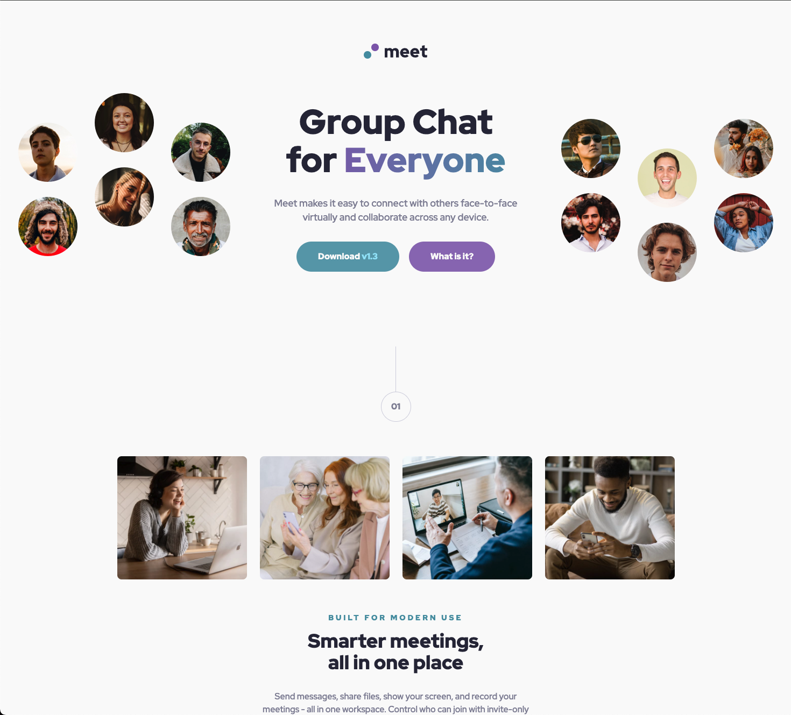
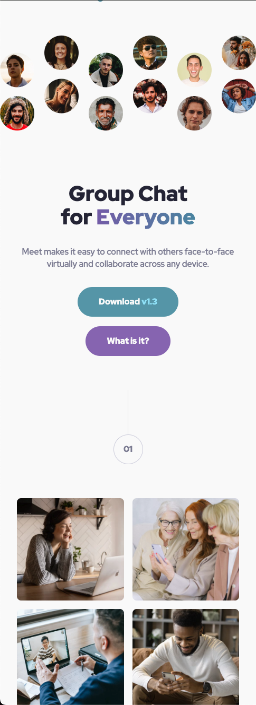

# Frontend Mentor - Meet landing page solution

This is a solution to the [Meet landing page challenge on Frontend Mentor](https://www.frontendmentor.io/challenges/meet-landing-page-rbTDS6OUR). Frontend Mentor challenges help you improve your coding skills by building realistic projects.

## Table of contents

- [Overview](#overview)
  - [The challenge](#the-challenge)
  - [Screenshot](#screenshot)
  - [Links](#links)
- [My process](#my-process)
  - [Built with](#built-with)
  - [What I learned](#what-i-learned)
  - [Continued development](#continued-development)
  - [Useful resources](#useful-resources)
- [Author](#author)

## Overview

### The challenge

Users should be able to:

- View the optimal layout depending on their device's screen size
- See hover states for interactive elements

### Screenshot




### Links

- Solution URL: [Solution URL here](https://github.com/hectorlil48/meet-landing-page)
- Live Site URL: [Live site URL here](https://hectorlil48.github.io/meet-landing-page/)

## My process

### Built with

- Semantic HTML5 markup
- CSS custom properties
- Flexbox
- CSS Grid
- Mobile-first workflow

### What I learned

I have learned so much from doing this project. I finally used semantic HTMl properly to outline my HTML. However, I have learned a lot more about using CSS. This was my first time doing a full page like this, so I got everything styled by separating my sections. I went back and put a lot of work into making my code look better and it has gotten better. I got to learn how to make a gradient color that I used on my title. I had to figure out how to add an image behind the text and still have a background color. That was hard and I still don’t know how to keep my image from stretching too much when resided. Making animations in CSS was something I didn’t understand at first but I love it now that I know how to use keyframes.

```html
<header class="flex">
  <a href="index.html">
    <div class="meet-logo">
      
    </div>
  </a>
</header>
```

```css
.gradient-text {
  background: linear-gradient(92.19deg, #855fb1 -15.84%, #4d96a9 114.64%);
  -webkit-background-clip: text;
  -webkit-text-fill-color: transparent;
  background-clip: text;
}

.footer-wrapper::before {
  content: "";
  background-image: url(../assets/mobile/image-footer.jpg);
  background-size: cover;
  position: absolute;
  top: 0rem;
  right: 0rem;
  bottom: 0rem;
  left: 0rem;
  opacity: 0.2;
  z-index: -5;
}

@-webkit-keyframes slideIn {
  0% {
    transform: translateY(-20px);
    opacity: 0;
  }

  100% {
    transform: translateX(0px);
    opacity: 1;
  }
}
```

### Continued development

I feel like I am improving with CSS, so I want to keep practicing. I am particularly interested in learning more about using background images effectively.

### Useful resources

- [ChatGPT](https://chatgpt.com/) - ChatGPT has been really helpful to me. It made me realize that using rem units is better than static units like px, as it ensures a more responsive page. After learning this, I switched all my margins, paddings, and fonts to use rem. Additionally, ChatGPT helped me understand how to create an animation using keyframes.
- [W3schools](https://www.w3schools.com/) - W3Schools is a valuable resource for refreshing my understanding of CSS, especially when it comes to margins and paddings. I often use it to quickly look up CSS styles.

## Author

- GitHub - [Hector Ramirez](https://github.com/hectorlil48)
- Frontend Mentor - [@hectorlil48](https://www.frontendmentor.io/profile/hectorlil48)
- LinkedIn - [@linkedin.com/in/hector-ramirez-6a6509170](https://www.linkedin.com/in/hector-ramirez-6a6509170/overlay/contact-info/)
